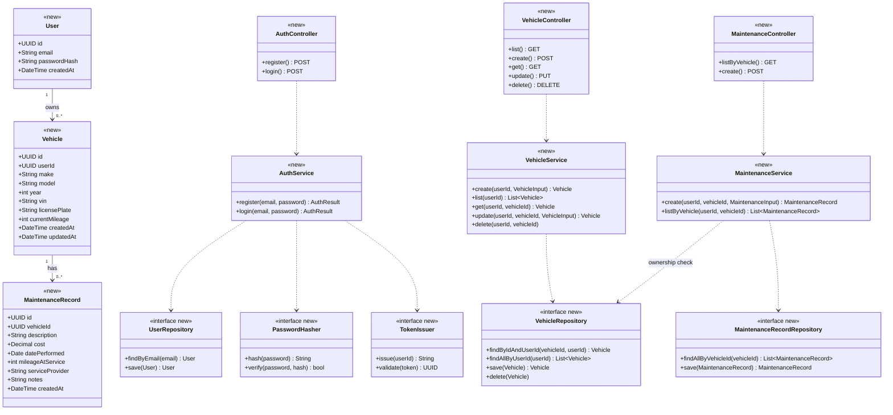
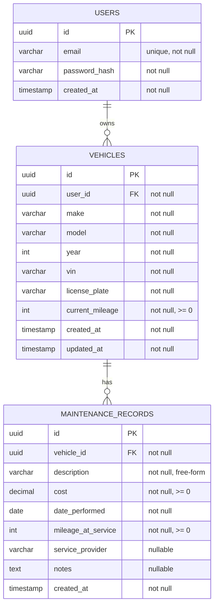
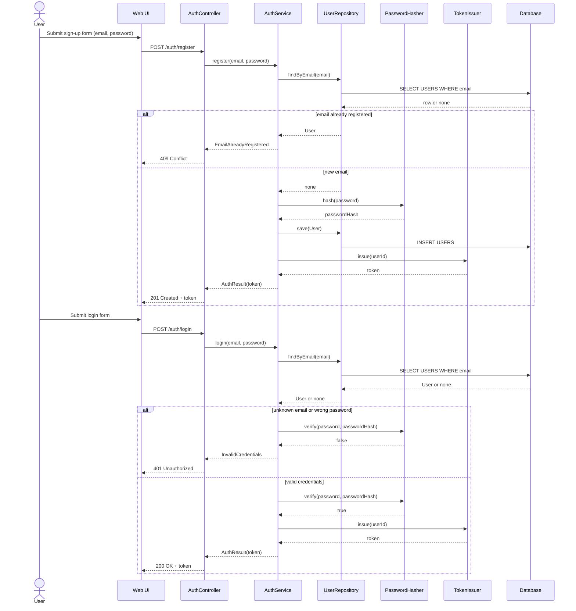
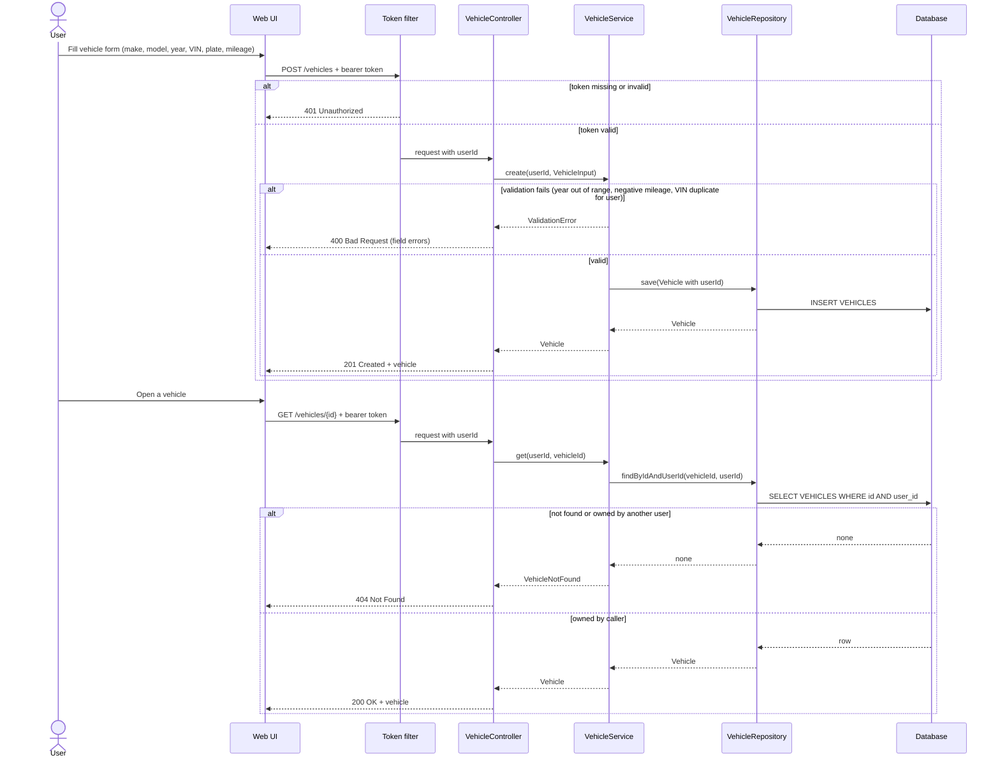
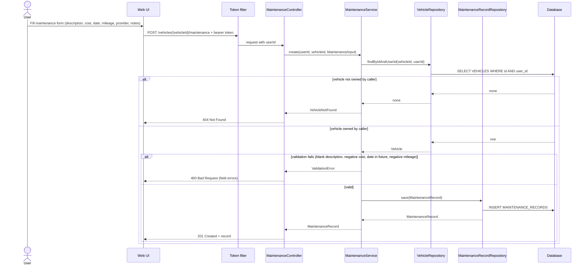
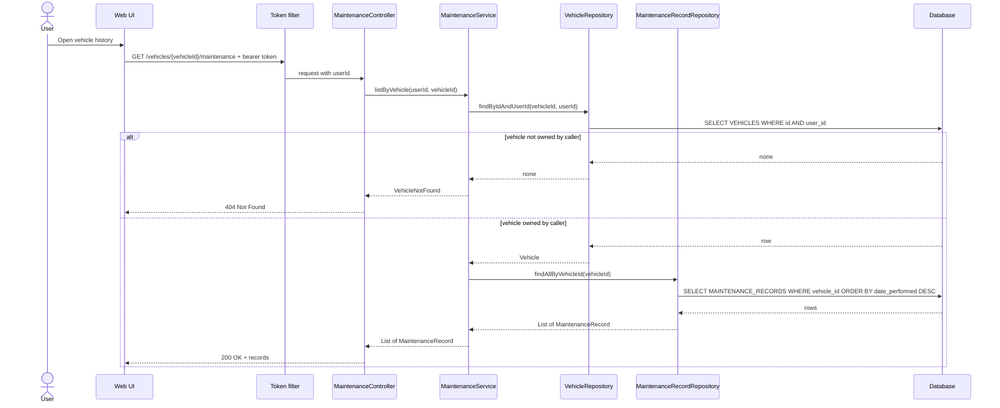
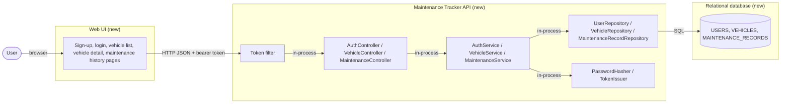
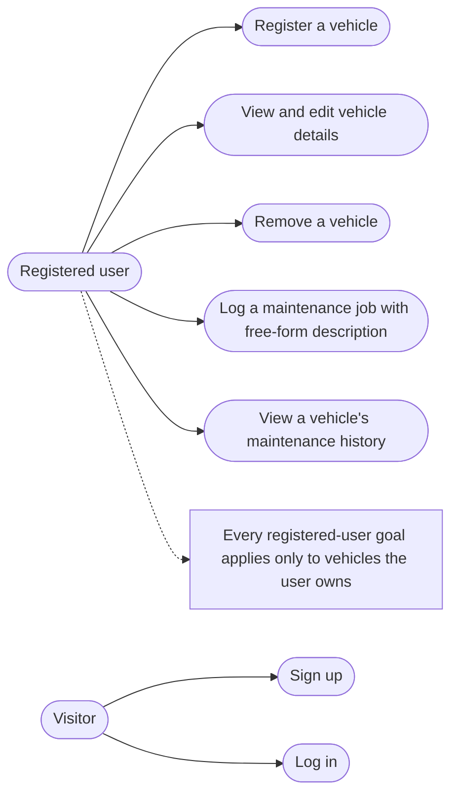
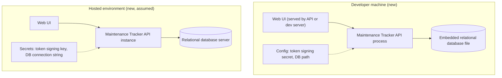

# Vehicle Maintenance Tracker

## Status

Design produced on 2026-09-07. Mermaid validation: validated with Mermaid CLI (mmdc) 11.17.0 — 9 diagrams.
Codebase grounding: repository `TechnicalTestModernTech` at branch `main`. The repository contains only a one-line `README.md` and no application code, so every element in this design is `new` and the design is effectively greenfield.

Input: `Docs/Vehicle Maintenance Tracker.md`, section "Phase 1a — Clarified Story". The technology stack was explicitly deferred by that document to a later phase, so this design describes layers, contracts, and data in stack-neutral terms and records the stack as an open technical question.

## Overview

The application lets an authenticated user register one or more vehicles and log any kind of maintenance job against each of them, then browse that vehicle's maintenance history. The solution is a layered web application: a JSON REST API backed by a relational database, consumed by a web user interface. Every data access is scoped by the authenticated user's identifier, so ownership isolation is enforced once, in the application services, rather than in each endpoint. Maintenance type is a free-form description column, not a lookup table, so users are never restricted to predefined categories.

## Design Drivers

| Driver | Source |
|---|---|
| Actor: registered user who owns vehicles | "A user can sign up and log in; each user can only see and manage their own vehicles and maintenance records." |
| Authentication and per-user data isolation | "Multi-user with authentication is required; each user's data must be private to them." (Phase 1a answers) |
| Entity: Vehicle with make, model, year, VIN, license plate, current mileage | "A user can record and view, for each vehicle: make, model, year, VIN, license plate, and current mileage." |
| Multiple vehicles per user | "Multiple vehicles per user must be supported." (Phase 1a answers) |
| Entity: MaintenanceRecord with description, cost, date performed, mileage at service, service provider, notes | "A maintenance record captures cost, date performed, mileage at time of service, service provider, and free-form notes." |
| Free-form maintenance type | "not restricted to a predefined set of categories" |
| Operation: create a maintenance record for one of the user's vehicles | "A user can create a maintenance record associated with one of their vehicles." |
| Operation: view maintenance history per vehicle | "A user can view the history of maintenance records logged for a given vehicle." |
| Operation: register and manage vehicles | "A user can register and manage multiple vehicles." |
| Constraint: schema must not fix categories and must key vehicles to users and records to vehicles | Phase 2 "Risks and Dependencies" |
| Constraint: stack undecided; local toolchain has Java 17 and Maven on PATH, .NET 8 SDK off PATH, no Node, Docker, or PostgreSQL client | Phase 2 "Risks and Dependencies" and "Open Technical Questions" |
| Quality attribute: ownership checks designed in from the first data-access layer | Phase 2 "Authentication and per-user isolation is a cross-cutting requirement…" |

## Diagram Inclusion

| Diagram | Included | Reason |
|---|---|---|
| Class | Yes | Always produced |
| Database | Yes | Three new tables are introduced |
| Sequence | Yes | Always produced; four flows cover all seven acceptance criteria |
| State | No | No entity has a status or lifecycle; the input mentions no transitions such as approve, cancel, or expire |
| Component | Yes | The design spans a web UI, an API, and a database, and introduces those boundaries |
| Use case | Yes | Every acceptance criterion depends on the ownership permission of the authenticated user |
| Activity | No | Validation is linear; the only branches are ownership and input validation, already shown as `alt` blocks in the sequence diagrams |
| Deployment | Yes | A new deployable, a database, and a token-signing secret are required |

## Class Diagram

The diagram shows the three domain entities, the three application services that hold all business rules, the repository and security abstractions they depend on, and the HTTP controllers that expose them. All elements are `new`. The single most important structural choice is that `VehicleRepository.findByIdAndUserId` is the only way to load one vehicle, so `VehicleService` and `MaintenanceService` cannot reach another user's vehicle even by accident. `MaintenanceService` depends on `VehicleRepository` solely for that ownership check before creating or listing records. This diagram supports every acceptance criterion; the request and response shapes `VehicleInput`, `MaintenanceInput`, and `AuthResult` are described in the API Contract rather than drawn.

## Database Diagram

Three new tables. `VEHICLES.user_id` is the ownership key and is indexed because every vehicle query filters by it. `MAINTENANCE_RECORDS.vehicle_id` is indexed together with `date_performed` so history listing is a single index range scan. `description` is a plain text column with no foreign key to a category table, satisfying the "not restricted to a predefined set of categories" criterion. `service_provider` and `notes` are nullable because a user may not know or care to record them for every job; `cost`, `date_performed`, and `mileage_at_service` are required because the criteria name them as captured fields (this required/optional split is an assumption, see Open Questions). VIN uniqueness is enforced per user, not globally, so two accounts can independently register the same physical car (assumption).

### Migrations

| Change | Object | Detail | Reversible |
|---|---|---|---|
| Create table | `USERS` | `id uuid PK`, `email varchar(320) not null`, `password_hash varchar(255) not null`, `created_at timestamp not null default now` | Yes |
| Add index | `USERS.email` | Unique index `ux_users_email` | Yes |
| Create table | `VEHICLES` | `id uuid PK`, `user_id uuid not null FK USERS(id) on delete cascade`, `make varchar(100) not null`, `model varchar(100) not null`, `year int not null`, `vin varchar(17) not null`, `license_plate varchar(20) not null`, `current_mileage int not null check >= 0`, `created_at timestamp not null`, `updated_at timestamp not null` | Yes |
| Add index | `VEHICLES.user_id` | Index `ix_vehicles_user_id` | Yes |
| Add index | `VEHICLES(user_id, vin)` | Unique index `ux_vehicles_user_vin` | Yes |
| Create table | `MAINTENANCE_RECORDS` | `id uuid PK`, `vehicle_id uuid not null FK VEHICLES(id) on delete cascade`, `description varchar(200) not null`, `cost decimal(12,2) not null check >= 0`, `date_performed date not null`, `mileage_at_service int not null check >= 0`, `service_provider varchar(150) null`, `notes text null`, `created_at timestamp not null` | Yes |
| Add index | `MAINTENANCE_RECORDS(vehicle_id, date_performed)` | Index `ix_maintenance_vehicle_date` | Yes |

All migrations are additive on an empty schema, so rollback is a plain drop in reverse order.

## Sequence Diagrams

### Sign up and log in (AC 1)

Registration and login both end by issuing a token that the Web UI attaches to every later request. The same 401 response is returned for an unknown email and for a wrong password so the login endpoint does not reveal which emails are registered. All participants are `new`.

### Register and manage vehicles (AC 2, AC 3)

The token filter turns the bearer token into a `userId` before any controller runs; the controller never trusts a user identifier from the request body or path. Update and delete follow the same `findByIdAndUserId` pattern as the read shown here and are not drawn separately. A vehicle that belongs to another user produces the same 404 as a vehicle that does not exist. All participants are `new`.

### Record a maintenance job (AC 4, AC 5, AC 6)

The description is accepted as any non-blank text, which is what makes the maintenance type unrestricted (AC 5). Cost, date performed, mileage at service, service provider, and notes are all carried in `MaintenanceInput` (AC 6). Whether logging a record should also advance the vehicle's `currentMileage` is not stated in the input and is listed as an open product question; this flow does not update the vehicle. All participants are `new`.

### View maintenance history (AC 7)

History is returned newest first, ordered by `date_performed`, which the composite index supports directly. The ownership check happens before the record query, so the record repository never needs to know about users. All participants are `new`.

## Component Diagram

Three deployment units: the Web UI, the API, and the database. Every boundary is `new`. The Web UI calls only the API, never the database, and the API is the single place where ownership is enforced. Whether the Web UI is served by the same process as the API (server-rendered pages) or is a separately hosted single-page application is an open technical question; this diagram is valid for either.

## Use Case Diagram

Acceptance criteria map as follows: AC 1 to "Sign up" and "Log in" plus the ownership note; AC 2 to "Register a vehicle" and "Remove a vehicle"; AC 3 to "View and edit vehicle details"; AC 4, 5, and 6 to "Log a maintenance job"; AC 7 to "View a vehicle's maintenance history". "Remove a vehicle" and "edit vehicle details" are derived from the word "manage" in AC 2 and are listed under Assumptions. Editing or deleting a maintenance record is not named by any criterion and is left as an open product question.

## Deployment Diagram

Locally, the API runs as one process against an embedded database file, because neither a database server nor Docker is available on the observed machine. A hosted environment would swap the file for a database server through configuration only. The token signing secret must never be committed; it is supplied as configuration in both environments. The hosted environment is an assumption, since the input does not ask for deployment.

## Non-Functional Requirements

- **Performance** — Vehicle list, vehicle detail, and maintenance history respond within 300 ms at the 95th percentile for a user with up to 20 vehicles and 500 records per vehicle; create operations within 500 ms. Source: `assumed: single-user interactive use with indexed lookups; no numbers in the input`.
- **Scalability** — Data volume is small per user (tens of vehicles, hundreds of records each). The API is stateless because authentication is token-based, so instances scale horizontally behind the database; the database is the single shared component. Source: `derived: token-based authentication chosen in Design Decisions makes the API stateless`.
- **Availability and resilience** — No uptime target is stated. Every write is a single insert or update in one transaction, so operations are naturally atomic; no retries or queues are needed. Database connection failures return 503 with no partial writes. Source: `assumed: no availability requirement in the input`.
- **Security** — Passwords are stored only as salted hashes from a slow algorithm such as bcrypt or Argon2id, never in plain text or reversible form. Every non-auth endpoint requires a valid token; every query on vehicles and records is scoped by the caller's `userId`; resources owned by others return 404. All inputs are validated server-side (length limits, non-negative numbers, year range, non-blank description). Source: `stated` for authentication and isolation; `derived: per-user privacy requires server-side scoping` for the 404 behaviour and validation.
- **Data** — Referential integrity through foreign keys with cascade delete from user to vehicles to records; check constraints keep cost and mileage non-negative; VIN unique per user. Data is retained until the owner deletes it; no automatic expiry. Backup is the responsibility of the hosting environment. Source: `derived: multi-vehicle and per-vehicle history requirements` for keys; `assumed: no retention rule in the input` for retention.
- **Observability** — Structured request logs with method, path, status, latency, and `userId` (never the token or password); counters for sign-ups, logins, failed logins, vehicles created, and records created; an error log entry for every 5xx. Source: `assumed: minimum needed to operate an authenticated API`.
- **Compatibility** — Greenfield; no existing clients. The API is versioned by path prefix (`/api/v1`) from the start so future changes do not break the first client. Source: `assumed: low-cost convention for a new API`.
- **Maintainability and testability** — Services depend on repository, hasher, and token interfaces so business rules and ownership checks are unit-testable with in-memory fakes; endpoints are integration-tested against the embedded database; the README documents setup, run, and test commands. Source: `derived: Phase 2 lists automated tests and an empty README as affected areas`.
- **Compliance and privacy** — Email address and VIN plus license plate are personal data. They are visible only to the owning user and are removed by cascade when the user account is deleted. No regulatory regime is named in the input. Source: `derived: per-user privacy requirement`; regime `assumed` absent.
- **Operations** — Configuration by environment variables: database location or connection string, token signing secret, token lifetime. Migrations run automatically at API start-up on an empty schema. No feature flags. Rollback is redeploying the previous version and dropping the three tables if needed. Source: `assumed: simplest operating model for a new service`.

## API Contract

All paths are prefixed with `/api/v1`. All endpoints except the two under `/auth` require `Authorization: Bearer <token>` and return 401 when it is missing or invalid.

| Operation | Method and path | Request | Response | Errors | Change |
|---|---|---|---|---|---|
| Register | `POST /auth/register` | `{ email, password }` | `201 { token, userId }` | 400 invalid email or weak password, 409 email already registered | New |
| Log in | `POST /auth/login` | `{ email, password }` | `200 { token, userId }` | 400 malformed, 401 invalid credentials | New |
| List vehicles | `GET /vehicles` | none | `200 [ Vehicle ]` (caller's vehicles only) | 401 | New |
| Create vehicle | `POST /vehicles` | `VehicleInput { make, model, year, vin, licensePlate, currentMileage }` | `201 Vehicle` | 400 validation, 401, 409 duplicate VIN for this user | New |
| Get vehicle | `GET /vehicles/{vehicleId}` | none | `200 Vehicle` | 401, 404 not found or not owned | New |
| Update vehicle | `PUT /vehicles/{vehicleId}` | `VehicleInput` | `200 Vehicle` | 400, 401, 404, 409 duplicate VIN | New |
| Delete vehicle | `DELETE /vehicles/{vehicleId}` | none | `204` (cascades to its records) | 401, 404 | New |
| List maintenance history | `GET /vehicles/{vehicleId}/maintenance` | none | `200 [ MaintenanceRecord ]` newest first | 401, 404 | New |
| Create maintenance record | `POST /vehicles/{vehicleId}/maintenance` | `MaintenanceInput { description, cost, datePerformed, mileageAtService, serviceProvider?, notes? }` | `201 MaintenanceRecord` | 400 validation, 401, 404 | New |

`Vehicle` and `MaintenanceRecord` response bodies carry the attributes shown in the Class Diagram, excluding `userId` on `Vehicle` (implicit from the caller) and excluding all password material.

## Design Decisions

### Enforce ownership in the application services through user-scoped repository queries

- **Decision:** Every vehicle lookup goes through `findByIdAndUserId`, and `MaintenanceService` re-checks vehicle ownership before any record operation. Controllers never receive a user identifier from the client.
- **Alternatives considered:** Database row-level security (ties the design to a specific database engine before the stack is chosen); per-endpoint authorization checks in controllers (easy to forget on a new endpoint); a schema per user (over-engineered for this volume).
- **Consequences:** One extra indexed query on every maintenance operation. Ownership is testable in isolation with an in-memory repository fake, and a new endpoint cannot bypass it without deliberately adding a new repository method.

### Store maintenance type as a free-form text column

- **Decision:** `MAINTENANCE_RECORDS.description` is a plain text column with a length limit and no category table.
- **Alternatives considered:** A `MAINTENANCE_TYPES` lookup with an "Other" escape hatch (contradicts "not restricted to a predefined set"); a category column plus free text (adds a concept the input does not ask for).
- **Consequences:** No grouping or reporting by type in this iteration. If reporting is wanted later, an optional tag or category can be added without changing existing rows.

### Stateless token-based authentication

- **Decision:** Registration and login return a signed bearer token carrying the `userId`; the API keeps no session state.
- **Alternatives considered:** Server-side session cookies (simpler for a server-rendered UI, but ties the API to sticky sessions or a session store); delegating to an external identity provider (adds an external dependency the input does not require).
- **Consequences:** The API scales horizontally without shared state. Token revocation before expiry is not supported; a short token lifetime (assumed 24 hours) limits the exposure. If the UI decision lands on server-rendered pages, the token can be held in an HTTP-only cookie without changing the API.

### Return 404, not 403, for resources owned by another user

- **Decision:** A vehicle or record that exists but belongs to someone else is indistinguishable from one that does not exist.
- **Alternatives considered:** 403 Forbidden (reveals that the identifier is valid, which leaks the existence of other users' data).
- **Consequences:** Slightly less precise client error handling; stronger privacy, which the input names as a requirement.

### Cascade delete from user to vehicles to maintenance records

- **Decision:** Deleting a vehicle removes its records; deleting a user removes everything they own.
- **Alternatives considered:** Soft delete with an `is_deleted` flag (preserves history but the input asks for no audit trail and every query would need an extra filter); blocking deletion while records exist (frustrates the "manage vehicles" criterion).
- **Consequences:** Deletion is irreversible. The UI should confirm before deleting a vehicle with records.

### Monetary cost as a fixed-point decimal in a single implicit currency

- **Decision:** `cost` is `decimal(12,2)` with no currency column.
- **Alternatives considered:** Storing minor units as an integer (equally correct, less readable in queries); adding a currency code column (the input never mentions currency).
- **Consequences:** Multi-currency is not supported. Adding a currency column later is a nullable additive migration.

## Assumptions and Open Questions

### Assumptions

- Vehicle "manage" (AC 2) includes editing and deleting a vehicle, not only creating and listing it. The Update and Delete endpoints depend on this.
- Cost, date performed, and mileage at service are required on a maintenance record; service provider and notes are optional. The nullability in the migration table depends on this.
- VIN must be unique per user, not globally, and license plate is not unique. The `ux_vehicles_user_vin` index depends on this.
- A single implicit currency is used for cost.
- Authentication is email and password with a signed bearer token valid for 24 hours; no password reset, email verification, or external identity provider in this iteration.
- Logging a maintenance record does not change the vehicle's current mileage.
- Deleting a vehicle deletes its maintenance records.
- The local environment uses an embedded relational database file, because no database server or Docker is installed on the observed machine.
- Performance, observability, versioning, and operations targets are proposed defaults, as labelled in the NFR section.

### Open Questions

- **Product** — Should a user be able to edit or delete a maintenance record after logging it? No acceptance criterion names it; the design currently supports create and list only.
- **Product** — Should logging a maintenance record with a mileage higher than the vehicle's current mileage update the vehicle's current mileage automatically?
- **Product** — Are service provider and notes optional, and are cost, date, and mileage mandatory, as assumed?
- **Product** — Is VIN uniqueness per user acceptable, or must a VIN be unique across all users?
- **Product** — Is a single currency acceptable for cost, or must the currency be recorded?
- **Product** — Are password reset and email verification needed in this iteration?
- **Technical** — Which stack should implement this design: Java 17 with Maven (matches the tools on PATH and the author's sibling repository), .NET 8 (SDK present but not on PATH), or another stack requiring installation?
- **Technical** — Which relational database is acceptable: an embedded file database for local development and tests, a server such as PostgreSQL for hosting, or only one of them?
- **Technical** — Should the Web UI be server-rendered by the API process or a separate single-page application? The design supports both.
- **Technical** — Is `TechnicalTestModernTech` the intended repository for the implementation? Phase 2 inferred it.

### Questions Asked & Answers

| Question | Answer |
|---|---|
| None yet | |
