# Vehicle Maintenance Tracker

## Status

Design produced on 2026-09-07, updated the same day after four rounds of product answers; deployment revised to SQLite everywhere once the implementation design fixed the stack. Mermaid validation: validated with Mermaid CLI (mmdc) 11.17.0 — 13 diagrams.
Codebase grounding: repository `TechnicalTestModernTech` at branch `main`. The repository contains only a one-line `README.md` and no application code, so every element in this design is `new` and the design is effectively greenfield.

Input: `docs/plans/Vehicle Maintenance Tracker.md`, section "Phase 1a — Clarified Story" including the second clarification round. The technology stack was explicitly deferred by that document to a later phase, so this design describes layers, contracts, and data in stack-neutral terms and records the stack as an open technical question.

## Overview

The application lets an authenticated user register one or more vehicles and log any kind of maintenance job against each of them, then browse, edit, and delete that vehicle's maintenance history. The solution is a layered web application: a JSON REST API backed by a relational database, consumed by a web user interface, with an outbound email channel for account verification and password reset. Every data access is scoped by the authenticated user's identifier, so ownership isolation is enforced once, in the application services, rather than in each endpoint. Maintenance type is a free-form description column, not a lookup table, so users are never restricted to predefined categories. Costs are in US dollars only.

## Design Drivers

| Driver | Source |
|---|---|
| Actor: registered user who owns vehicles | "A user can sign up and log in; each user can only see and manage their own vehicles and maintenance records." |
| Authentication and per-user data isolation | "Multi-user with authentication is required; each user's data must be private to them." (Phase 1a answers) |
| Email verification and password reset are required | "Are password reset and email verification needed in this iteration? Yes, it's required." (Phase 1a, second round) |
| Entity: Vehicle with make, model, year, VIN, license plate, current mileage | "A user can record and view, for each vehicle: make, model, year, VIN, license plate, and current mileage." |
| Multiple vehicles per user | "Multiple vehicles per user must be supported." (Phase 1a answers) |
| Entity: MaintenanceRecord with description, cost, date performed, mileage at service, service provider, notes | "A maintenance record captures cost, date performed, mileage at time of service, service provider, and free-form notes." |
| Cost, date performed, and mileage at service are mandatory; service provider and notes are optional | Phase 1a, second round: "Yes, it is." |
| Cost is in US dollars only | Phase 1a, second round: "We will work on USD. That's the only currency allowed." |
| Free-form maintenance type | "not restricted to a predefined set of categories" |
| Operation: create, edit, and delete a maintenance record for one of the user's vehicles | "A user can create a maintenance record associated with one of their vehicles." and second round: "Should a user be able to edit or delete a maintenance record? Yes, it should." |
| Rule: a maintenance record with a higher mileage advances the vehicle's current mileage | Phase 1a, second round: "Should logging a maintenance record with a higher mileage automatically update the vehicle's current mileage? Yes, it should." |
| Operation: view maintenance history per vehicle | "A user can view the history of maintenance records logged for a given vehicle." |
| Operation: register and manage vehicles | "A user can register and manage multiple vehicles." |
| Constraint: schema must not fix categories and must key vehicles to users and records to vehicles | Phase 2 "Risks and Dependencies" |
| Rule: VIN is unique per user, not across all users | Phase 1a, second round: "Per user." |
| Constraint: stack undecided; local toolchain has Java 17 and Maven on PATH, .NET 8 SDK off PATH, no Node, Docker, or PostgreSQL client | Phase 2 "Risks and Dependencies" and "Open Technical Questions" |
| Quality attribute: ownership checks designed in from the first data-access layer | Phase 2 "Authentication and per-user isolation is a cross-cutting requirement…" |

## Diagram Inclusion

| Diagram | Included | Reason |
|---|---|---|
| Class | Yes | Always produced |
| Database | Yes | Four new tables are introduced |
| Sequence | Yes | Always produced; seven flows cover all acceptance criteria |
| State | Yes | A user account now has a lifecycle (pending verification, verified) and verification and reset tokens expire or are consumed |
| Component | Yes | The design spans a web UI, an API, a database, and an external email provider |
| Use case | Yes | Every acceptance criterion depends on the ownership permission of the authenticated user, and visitors have goals of their own |
| Activity | No | The only branching rules (ownership, validation, mileage advance, token validity) are each two-way and are shown as `alt`/`opt` blocks in the sequence diagrams |
| Deployment | Yes | A new deployable, a database, a token-signing secret, and email provider credentials are required |

## Class Diagram

```mermaid
classDiagram
  class User {
    <<new>>
    +UUID id
    +String email
    +String passwordHash
    +bool emailVerified
    +DateTime createdAt
  }
  class UserToken {
    <<new>>
    +UUID id
    +UUID userId
    +TokenPurpose purpose
    +String tokenHash
    +DateTime expiresAt
    +DateTime usedAt
  }
  class Vehicle {
    <<new>>
    +UUID id
    +UUID userId
    +String make
    +String model
    +int year
    +String vin
    +String licensePlate
    +int currentMileage
    +DateTime createdAt
    +DateTime updatedAt
  }
  class MaintenanceRecord {
    <<new>>
    +UUID id
    +UUID vehicleId
    +String description
    +Decimal costUsd
    +Date datePerformed
    +int mileageAtService
    +String serviceProvider
    +String notes
    +DateTime createdAt
    +DateTime updatedAt
  }
  class AuthService {
    <<new>>
    +register(email, password)
    +verifyEmail(token)
    +resendVerification(email)
    +login(email, password) AuthResult
    +requestPasswordReset(email)
    +resetPassword(token, newPassword)
  }
  class VehicleService {
    <<new>>
    +create(userId, VehicleInput) Vehicle
    +list(userId) List~Vehicle~
    +get(userId, vehicleId) Vehicle
    +update(userId, vehicleId, VehicleInput) Vehicle
    +delete(userId, vehicleId)
  }
  class MaintenanceService {
    <<new>>
    +create(userId, vehicleId, MaintenanceInput) MaintenanceRecord
    +listByVehicle(userId, vehicleId) List~MaintenanceRecord~
    +update(userId, vehicleId, recordId, MaintenanceInput) MaintenanceRecord
    +delete(userId, vehicleId, recordId)
    -advanceMileage(Vehicle, mileageAtService)
  }
  class UserRepository {
    <<interface new>>
    +findByEmail(email) User
    +save(User) User
  }
  class UserTokenRepository {
    <<interface new>>
    +findByHash(tokenHash) UserToken
    +save(UserToken) UserToken
  }
  class VehicleRepository {
    <<interface new>>
    +findByIdAndUserId(vehicleId, userId) Vehicle
    +findAllByUserId(userId) List~Vehicle~
    +save(Vehicle) Vehicle
    +delete(Vehicle)
  }
  class MaintenanceRecordRepository {
    <<interface new>>
    +findByIdAndVehicleId(recordId, vehicleId) MaintenanceRecord
    +findAllByVehicleId(vehicleId) List~MaintenanceRecord~
    +save(MaintenanceRecord) MaintenanceRecord
    +delete(MaintenanceRecord)
  }
  class PasswordHasher {
    <<interface new>>
    +hash(password) String
    +verify(password, hash) bool
  }
  class TokenIssuer {
    <<interface new>>
    +issue(userId) String
    +validate(token) UUID
  }
  class EmailSender {
    <<interface new>>
    +sendVerification(email, link)
    +sendPasswordReset(email, link)
  }
  class AuthController {
    <<new>>
    +register() POST
    +verifyEmail() POST
    +resendVerification() POST
    +login() POST
    +forgotPassword() POST
    +resetPassword() POST
  }
  class VehicleController {
    <<new>>
    +list() GET
    +create() POST
    +get() GET
    +update() PUT
    +delete() DELETE
  }
  class MaintenanceController {
    <<new>>
    +listByVehicle() GET
    +create() POST
    +update() PUT
    +delete() DELETE
  }

  User "1" --> "0..*" Vehicle : owns
  User "1" --> "0..*" UserToken : issued
  Vehicle "1" --> "0..*" MaintenanceRecord : has
  AuthController ..> AuthService
  VehicleController ..> VehicleService
  MaintenanceController ..> MaintenanceService
  AuthService ..> UserRepository
  AuthService ..> UserTokenRepository
  AuthService ..> PasswordHasher
  AuthService ..> TokenIssuer
  AuthService ..> EmailSender
  VehicleService ..> VehicleRepository
  MaintenanceService ..> VehicleRepository : ownership check and mileage advance
  MaintenanceService ..> MaintenanceRecordRepository
```

The diagram shows the four domain entities, the three application services that hold all business rules, the repository, security, and email abstractions they depend on, and the HTTP controllers that expose them. All elements are `new`. `UserToken` holds both email-verification and password-reset tokens, distinguished by `purpose`, and stores only a hash of the token that was emailed. `MaintenanceService` depends on `VehicleRepository` for two reasons: the ownership check before any record operation, and the `advanceMileage` rule that raises `Vehicle.currentMileage` when a record's `mileageAtService` exceeds it. `VehicleRepository.findByIdAndUserId` is the only way to load one vehicle, so no service can reach another user's vehicle even by accident. Request and response shapes `VehicleInput`, `MaintenanceInput`, and `AuthResult` are described in the API Contract rather than drawn.

## Database Diagram

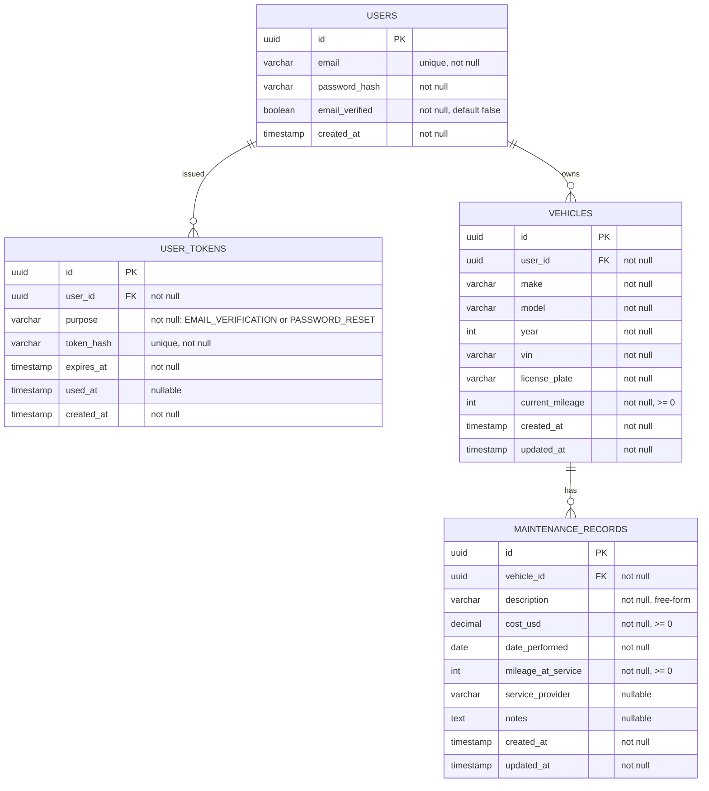

Four new tables. `VEHICLES.user_id` is the ownership key and is indexed because every vehicle query filters by it. `MAINTENANCE_RECORDS.vehicle_id` is indexed together with `date_performed` so history listing is a single index range scan. `description` is a plain text column with no foreign key to a category table, satisfying the "not restricted to a predefined set of categories" criterion. `cost_usd` carries the currency in its name because USD is the only currency allowed; there is no currency column. `service_provider` and `notes` are nullable and `cost_usd`, `date_performed`, and `mileage_at_service` are required, as confirmed. `USER_TOKENS.token_hash` is unique so a token can be looked up directly and can never be presented twice; `used_at` marks consumption. VIN uniqueness is enforced per user, not globally, as decided: two accounts may register the same physical car, and no user is ever blocked by another user's entry.

### Migrations

| Change | Object | Detail | Reversible |
|---|---|---|---|
| Create table | `USERS` | `id uuid PK`, `email varchar(320) not null`, `password_hash varchar(255) not null`, `email_verified boolean not null default false`, `created_at timestamp not null default now` | Yes |
| Add index | `USERS.email` | Unique index `ux_users_email` | Yes |
| Create table | `USER_TOKENS` | `id uuid PK`, `user_id uuid not null FK USERS(id) on delete cascade`, `purpose varchar(20) not null check in (EMAIL_VERIFICATION, PASSWORD_RESET)`, `token_hash varchar(64) not null`, `expires_at timestamp not null`, `used_at timestamp null`, `created_at timestamp not null` | Yes |
| Add index | `USER_TOKENS.token_hash` | Unique index `ux_user_tokens_hash` | Yes |
| Add index | `USER_TOKENS(user_id, purpose)` | Index `ix_user_tokens_user_purpose` for resend and invalidation lookups | Yes |
| Create table | `VEHICLES` | `id uuid PK`, `user_id uuid not null FK USERS(id) on delete cascade`, `make varchar(100) not null`, `model varchar(100) not null`, `year int not null`, `vin varchar(17) not null`, `license_plate varchar(20) not null`, `current_mileage int not null check >= 0`, `created_at timestamp not null`, `updated_at timestamp not null` | Yes |
| Add index | `VEHICLES.user_id` | Index `ix_vehicles_user_id` | Yes |
| Add index | `VEHICLES(user_id, vin)` | Unique index `ux_vehicles_user_vin` | Yes |
| Create table | `MAINTENANCE_RECORDS` | `id uuid PK`, `vehicle_id uuid not null FK VEHICLES(id) on delete cascade`, `description varchar(200) not null`, `cost_usd decimal(12,2) not null check >= 0`, `date_performed date not null`, `mileage_at_service int not null check >= 0`, `service_provider varchar(150) null`, `notes text null`, `created_at timestamp not null`, `updated_at timestamp not null` | Yes |
| Add index | `MAINTENANCE_RECORDS(vehicle_id, date_performed)` | Index `ix_maintenance_vehicle_date` | Yes |

All migrations are additive on an empty schema, so rollback is a plain drop in reverse order.

## Sequence Diagrams

### Sign up and verify email (AC 1, AC 8)

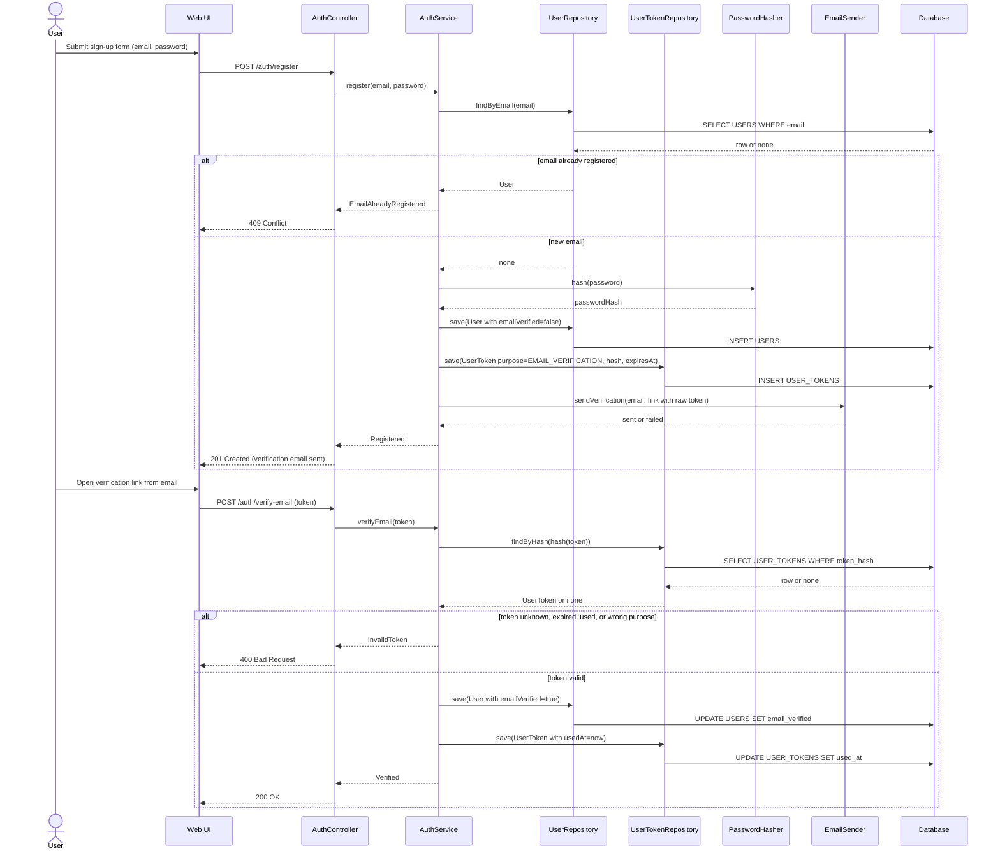

Registration stores the user unverified and emails a single-use verification link; the raw token travels only in the email, and the database keeps its hash. The response to registration is the same whether or not the email provider accepted the message, and the user can ask for a resend (`POST /auth/resend-verification`, not drawn: it invalidates earlier verification tokens for that user and repeats the token-and-email steps). Verification is idempotent from the user's view: a second click on a used link gets 400, and the account stays verified. All participants are `new`.

### Log in (AC 1, AC 8)

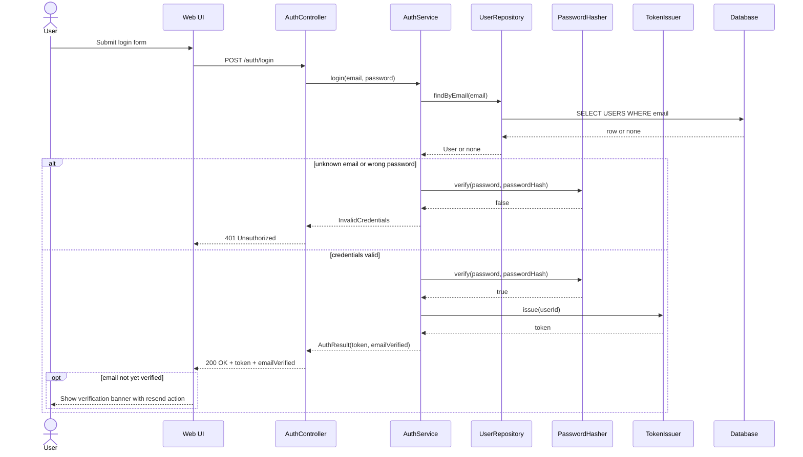

The same 401 response is returned for an unknown email and for a wrong password, so the login endpoint does not reveal which emails are registered. Verification does not gate login: an unverified account with correct credentials receives a session token like any other, plus an `emailVerified` flag the Web UI uses to show a persistent banner with a resend action. All participants are `new`.

### Reset a forgotten password (AC 9)

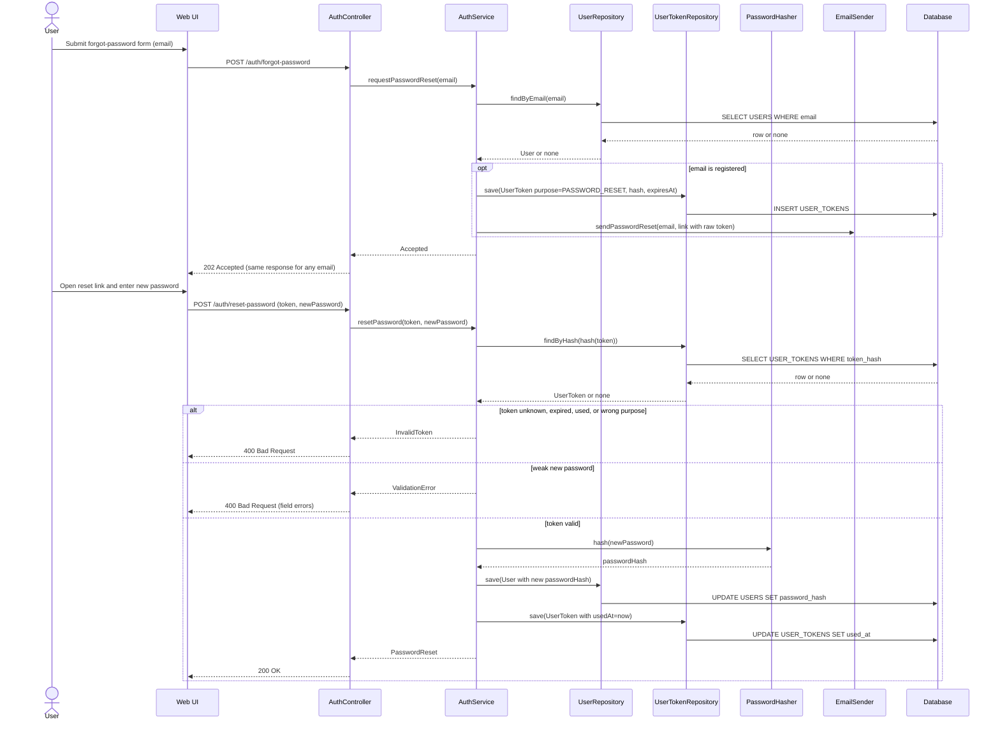

The forgot-password endpoint always answers 202, whether or not the email exists, so it cannot be used to enumerate accounts. Reset tokens are single-use and short-lived. A successful reset does not log the user in; they log in with the new password. All participants are `new`.

### Register and manage vehicles (AC 2, AC 3)

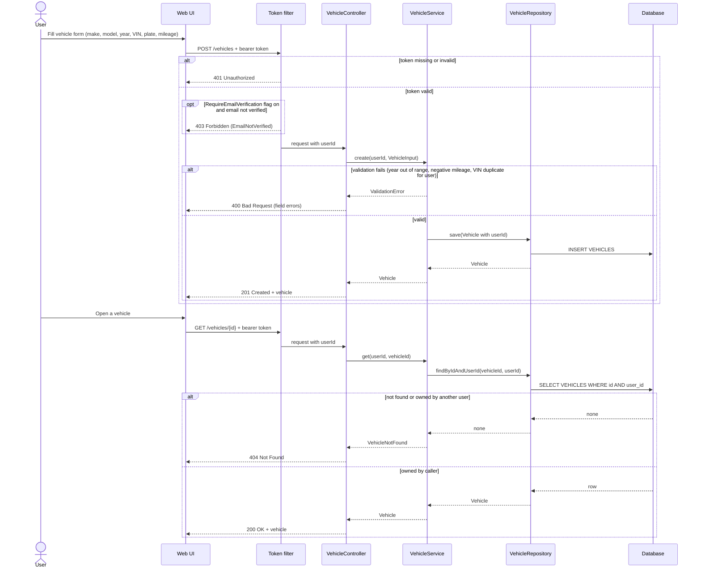

The token filter turns the bearer token into a `userId` before any controller runs; the controller never trusts a user identifier from the request body or path. When the `RequireEmailVerification` flag is on, the filter also looks up the account's `emailVerified` value and rejects unverified accounts on every endpoint outside `/auth` with 403, so a user who verifies mid-session gains access without logging in again. The flag is off by default, so all features are available without verification. Update and delete follow the same `findByIdAndUserId` pattern as the read shown here and are not drawn separately. A vehicle that belongs to another user produces the same 404 as a vehicle that does not exist. All participants are `new`.

### Record a maintenance job and advance mileage (AC 4, AC 5, AC 6, AC 11)

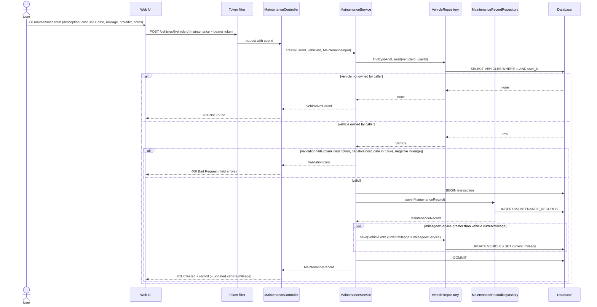

The description is accepted as any non-blank text, which is what makes the maintenance type unrestricted (AC 5). Cost in USD, date performed, and mileage at service are required; service provider and notes are optional (AC 6). When the record's mileage exceeds the vehicle's current mileage, the vehicle is updated in the same transaction (AC 11), so the two can never disagree after a partial failure. A record with lower mileage, such as a back-dated job, leaves the vehicle unchanged. All participants are `new`.

### Edit or delete a maintenance record (AC 10)

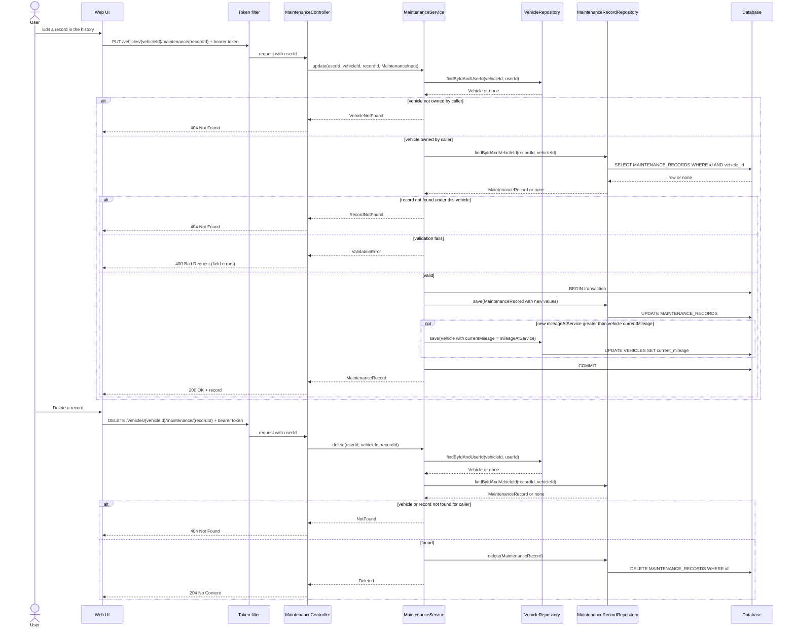

Both operations locate the record through its vehicle, and the vehicle through its owner, so a record identifier from another user's vehicle is never found. Editing applies the same validation and the same mileage-advance rule as creation. Deleting a record does not lower the vehicle's current mileage, because the odometer reading was real even if the record was entered by mistake (assumption). All participants are `new`.

### View maintenance history (AC 7)

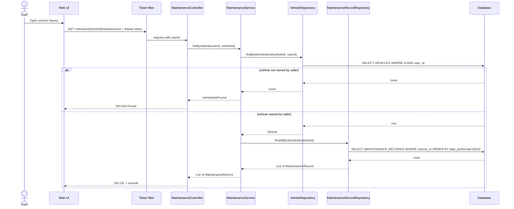

History is returned newest first, ordered by `date_performed`, which the composite index supports directly. The ownership check happens before the record query, so the record repository never needs to know about users. All participants are `new`.

## State Diagram

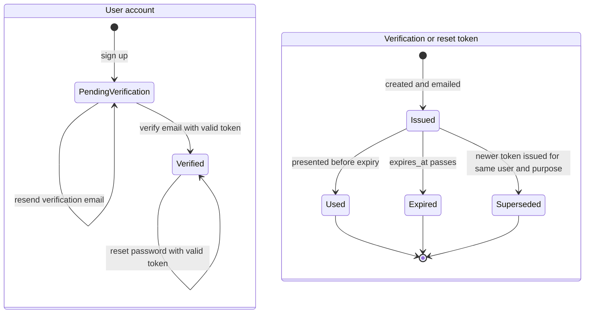

A user account is created pending verification and becomes verified exactly once; there is no transition back, and no account deletion or deactivation is in scope. Both states can log in; verification is prompted, not enforced. A token is consumed by a single successful use, dies silently at its expiry time, or is superseded when the user asks for a new one of the same purpose; the `Superseded` state is implemented as setting `used_at` on the older rows, so it needs no extra column. The input does not define resend limits (assumed) or token lifetimes (open question). All states are `new`.

## Component Diagram

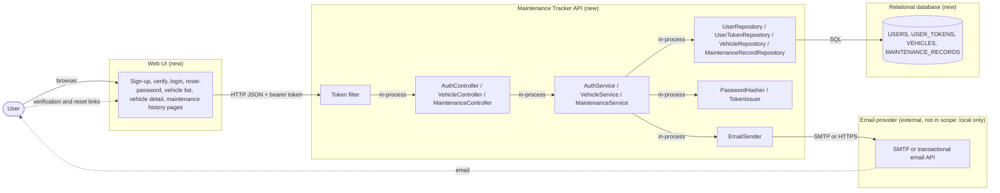

Four units: the Web UI, the API, the database, and an external email provider reached only through the `EmailSender` interface. Every boundary is `new`. The Web UI calls only the API, never the database, and the API is the single place where ownership is enforced. Emailed links point back at the Web UI, which forwards the embedded token to the API. Whether the Web UI is served by the same process as the API or is a separately hosted single-page application is an open technical question; this diagram is valid for either.

## Use Case Diagram

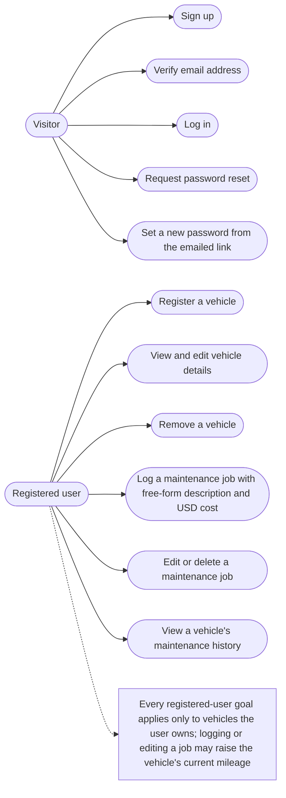

Acceptance criteria map as follows: AC 1 to "Sign up" and "Log in" plus the ownership note; AC 8 to "Verify email address"; AC 9 to "Request password reset" and "Set a new password"; AC 2 to "Register a vehicle" and "Remove a vehicle"; AC 3 to "View and edit vehicle details"; AC 4, 5, 6, and 12 to "Log a maintenance job"; AC 10 to "Edit or delete a maintenance job"; AC 11 to the note on the registered user; AC 7 to "View a vehicle's maintenance history". "Remove a vehicle" and "edit vehicle details" are derived from the word "manage" in AC 2 and are listed under Assumptions.

## Deployment Diagram

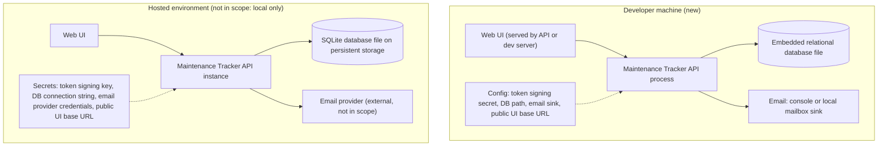

Locally, the API runs as one process against a SQLite database file and writes emails to the console or a local mailbox sink. SQLite is the database in every environment (decided in the implementation design); a hosted environment differs only in keeping the file on persistent storage and in using a real email provider, both through configuration. The public UI base URL is configuration because it is embedded in the emailed links. Secrets must never be committed. The user decided on 2026-09-07 that the project runs locally only and is not published to the internet; the hosted subgraph is kept to show what would change, nothing more.

## Non-Functional Requirements

- **Performance** — Vehicle list, vehicle detail, and maintenance history respond within 300 ms at the 95th percentile for a user with up to 20 vehicles and 500 records per vehicle; create, update, and delete operations within 500 ms excluding email delivery. Registration and forgot-password respond within 1 s including the synchronous email hand-off. Source: `assumed: single-user interactive use with indexed lookups; no numbers in the input`.
- **Scalability** — Data volume is small per user (tens of vehicles, hundreds of records each). The API is stateless because authentication is token-based, so instances scale horizontally behind the database; the database is the single shared component. Source: `derived: token-based authentication chosen in Design Decisions makes the API stateless`.
- **Availability and resilience** — No uptime target is stated. Every write is a single transaction: record insert or update together with the optional vehicle mileage update, so the two can never disagree. Email hand-off failure does not fail registration or forgot-password; the user can trigger a resend. Database connection failures return 503 with no partial writes. Source: `derived: AC 11 requires record and vehicle mileage to stay consistent` for the transaction; `assumed: no availability requirement in the input` for the rest.
- **Security** — Passwords are stored only as salted hashes from a slow algorithm such as bcrypt or Argon2id. Verification and reset tokens are at least 32 random bytes, stored only as a SHA-256 hash, single-use, and expire 30 minutes after issue for both purposes (configurable). Forgot-password and login responses do not reveal whether an email is registered. Every non-auth endpoint requires a valid session token; every query on vehicles and records is scoped by the caller's `userId`; resources owned by others return 404. All inputs are validated server-side (length limits, non-negative numbers, year range, non-blank description, password strength). Login and forgot-password are rate-limited per email and per client address. Source: `stated` for authentication, verification, reset, and isolation; `derived: per-user privacy requires server-side scoping` for the 404 behaviour and validation; `stated` for the 30-minute token lifetime; `assumed` for rate limits.
- **Data** — Referential integrity through foreign keys with cascade delete from user to tokens, vehicles, and records; check constraints keep cost and mileage non-negative; VIN unique per user. Cost is always USD, stored as `decimal(12,2)`. Data is retained until the owner deletes it; used and expired tokens may be purged after 30 days. Backup is the responsibility of the hosting environment. Source: `stated` for USD and per-user VIN uniqueness; `derived: multi-vehicle and per-vehicle history requirements` for keys; `assumed: no retention rule in the input` for retention and purge.
- **Observability** — Structured request logs with method, path, status, latency, and `userId` (never the session token, verification token, or password); counters for sign-ups, verifications, logins, failed logins, reset requests, resets, emails sent and failed, vehicles created, records created, updated, and deleted, and mileage advances; an error log entry for every 5xx and every email failure. Source: `assumed: minimum needed to operate an authenticated API with an email dependency`.
- **Compatibility** — Greenfield; no existing clients. The API is versioned by path prefix (`/api/v1`) from the start so future changes do not break the first client. Source: `assumed: low-cost convention for a new API`.
- **Maintainability and testability** — Services depend on repository, hasher, token, and email interfaces so business rules, ownership checks, the mileage-advance rule, and token validity are unit-testable with in-memory fakes; endpoints are integration-tested against the embedded database with a fake email sink; the README documents setup, run, and test commands. Source: `derived: Phase 2 lists automated tests and an empty README as affected areas`.
- **Compliance and privacy** — Email address, VIN, and license plate are personal data. They are visible only to the owning user and are removed by cascade when the user account is deleted. Verification and reset emails contain no personal data beyond the recipient address. No regulatory regime is named in the input. Source: `derived: per-user privacy requirement`; regime `assumed` absent.
- **Operations** — Configuration by environment variables: database location or connection string, session token signing secret and lifetime, verification and reset token lifetimes, email provider credentials or local sink, public UI base URL for emailed links. Migrations run automatically at API start-up on an empty schema. One feature flag, `RequireEmailVerification` (default off): when on, every endpoint outside `/auth` returns 403 for an account whose email is not verified. Rollback is redeploying the previous version and dropping the four tables if needed. Source: `assumed: simplest operating model for a new service`.

## API Contract

All paths are prefixed with `/api/v1`. All endpoints outside `/auth` require `Authorization: Bearer <token>` and return 401 when it is missing or invalid; when the `RequireEmailVerification` flag is on they also return 403 `EmailNotVerified` for unverified accounts. Monetary values are USD with two decimals.

| Operation | Method and path | Request | Response | Errors | Change |
|---|---|---|---|---|---|
| Register | `POST /auth/register` | `{ email, password }` | `201 { message }` (verification email sent, no session) | 400 invalid email or weak password, 409 email already registered | New |
| Verify email | `POST /auth/verify-email` | `{ token }` | `200 { message }` | 400 token unknown, expired, used, or wrong purpose | New |
| Resend verification | `POST /auth/resend-verification` | `{ email }` | `202 { message }` (same response for any email) | 400 malformed, 429 rate-limited | New |
| Log in | `POST /auth/login` | `{ email, password }` | `200 { token, userId, emailVerified }` | 400 malformed, 401 invalid credentials, 429 rate-limited | New |
| Forgot password | `POST /auth/forgot-password` | `{ email }` | `202 { message }` (same response for any email) | 400 malformed, 429 rate-limited | New |
| Reset password | `POST /auth/reset-password` | `{ token, newPassword }` | `200 { message }` | 400 token invalid or weak password | New |
| List vehicles | `GET /vehicles` | none | `200 [ Vehicle ]` (caller's vehicles only) | 401 | New |
| Create vehicle | `POST /vehicles` | `VehicleInput { make, model, year, vin, licensePlate, currentMileage }` | `201 Vehicle` | 400 validation, 401, 409 duplicate VIN for this user | New |
| Get vehicle | `GET /vehicles/{vehicleId}` | none | `200 Vehicle` | 401, 404 not found or not owned | New |
| Update vehicle | `PUT /vehicles/{vehicleId}` | `VehicleInput` | `200 Vehicle` | 400, 401, 404, 409 duplicate VIN | New |
| Delete vehicle | `DELETE /vehicles/{vehicleId}` | none | `204` (cascades to its records) | 401, 404 | New |
| List maintenance history | `GET /vehicles/{vehicleId}/maintenance` | none | `200 [ MaintenanceRecord ]` newest first | 401, 404 | New |
| Create maintenance record | `POST /vehicles/{vehicleId}/maintenance` | `MaintenanceInput { description, costUsd, datePerformed, mileageAtService, serviceProvider?, notes? }` | `201 { record: MaintenanceRecord, vehicleCurrentMileage }` | 400 validation, 401, 404 | New |
| Update maintenance record | `PUT /vehicles/{vehicleId}/maintenance/{recordId}` | `MaintenanceInput` | `200 { record: MaintenanceRecord, vehicleCurrentMileage }` | 400 validation, 401, 404 vehicle or record not found | New |
| Delete maintenance record | `DELETE /vehicles/{vehicleId}/maintenance/{recordId}` | none | `204` | 401, 404 | New |

`Vehicle` and `MaintenanceRecord` response bodies carry the attributes shown in the Class Diagram, excluding `userId` on `Vehicle` (implicit from the caller) and excluding all password and token material. Create and update of a maintenance record return the vehicle's resulting current mileage so the UI can refresh it without a second call.

## Design Decisions

### Enforce ownership in the application services through user-scoped repository queries

- **Decision:** Every vehicle lookup goes through `findByIdAndUserId`, every record lookup goes through `findByIdAndVehicleId` after that, and `MaintenanceService` re-checks vehicle ownership before any record operation. Controllers never receive a user identifier from the client.
- **Alternatives considered:** Database row-level security (ties the design to a specific database engine before the stack is chosen); per-endpoint authorization checks in controllers (easy to forget on a new endpoint); a schema per user (over-engineered for this volume).
- **Consequences:** One extra indexed query on every maintenance operation. Ownership is testable in isolation with an in-memory repository fake, and a new endpoint cannot bypass it without deliberately adding a new repository method.

### Store maintenance type as a free-form text column

- **Decision:** `MAINTENANCE_RECORDS.description` is a plain text column with a length limit and no category table.
- **Alternatives considered:** A `MAINTENANCE_TYPES` lookup with an "Other" escape hatch (contradicts "not restricted to a predefined set"); a category column plus free text (adds a concept the input does not ask for).
- **Consequences:** No grouping or reporting by type in this iteration. If reporting is wanted later, an optional tag or category can be added without changing existing rows.

### Advance vehicle mileage inside the maintenance record transaction

- **Decision:** Creating or updating a record whose `mileageAtService` exceeds the vehicle's `currentMileage` updates the vehicle in the same database transaction. Lower mileage never lowers the vehicle. Deleting a record never changes the vehicle.
- **Alternatives considered:** Computing current mileage on read as the maximum over records and the vehicle's own value (correct but makes every vehicle read a join and hides the value from the vehicle table); updating asynchronously after the record is saved (allows the two to disagree after a crash); recomputing on delete (would lower the odometer reading, which is physically wrong).
- **Consequences:** The vehicle row is touched on some record writes, so the record and vehicle repositories must share one unit of work. A mistaken high mileage entry can only be corrected by editing the vehicle directly.

### Single shared token table for email verification and password reset

- **Decision:** One `USER_TOKENS` table with a `purpose` column holds both kinds of token; each stores only a SHA-256 hash of the emailed value, is single-use, and expires.
- **Alternatives considered:** Two tables (duplicate structure and repository for no behavioural difference); storing the token in clear (a database leak would allow account takeover); signed stateless tokens such as JWT for reset links (cannot be revoked or made single-use without a table anyway).
- **Consequences:** A purpose check is required on every lookup so a verification token cannot reset a password. Old rows accumulate and need a periodic purge.

### Email verification prompts but does not block login

- **Decision:** Login succeeds for verified and unverified accounts alike and returns an `emailVerified` flag; the Web UI shows a persistent banner with a resend action until the address is verified. All features are available without verification by default. A configuration flag, `RequireEmailVerification` (default off), switches that: when on, the token filter rejects unverified accounts on every endpoint outside `/auth` with 403, checking the account's current `emailVerified` value on each request rather than a claim in the token.
- **Alternatives considered:** Blocking login until verified (rejected by the product: a user who never receives the email would be locked out); allowing login but gating selected features (no feature was named to gate; can be added later by checking the flag in the relevant service).
- **Consequences:** With the flag off, verification is a nudge, so the email address on an account may be wrong until the user acts. With the flag on, one indexed lookup per request is added and the Web UI must route a 403 `EmailNotVerified` to the verification screen. Because the flag is global, there is no per-feature gating; adding one later means a policy in the application service next to the ownership check.

### Stateless token-based session authentication

- **Decision:** Login returns a signed bearer token carrying the `userId`; the API keeps no session state.
- **Alternatives considered:** Server-side session cookies (simpler for a server-rendered UI, but ties the API to sticky sessions or a session store); delegating to an external identity provider (adds an external dependency the input does not require, and the required verification and reset flows would then live outside the application).
- **Consequences:** The API scales horizontally without shared state. Session revocation before expiry is not supported; a short lifetime (assumed 24 hours) limits the exposure. If the UI decision lands on server-rendered pages, the token can be held in an HTTP-only cookie without changing the API.

### Return 404, not 403, for resources owned by another user

- **Decision:** A vehicle or record that exists but belongs to someone else is indistinguishable from one that does not exist.
- **Alternatives considered:** 403 Forbidden (reveals that the identifier is valid, which leaks the existence of other users' data).
- **Consequences:** Slightly less precise client error handling; stronger privacy, which the input names as a requirement.

### Cascade delete from user to tokens, vehicles, and maintenance records

- **Decision:** Deleting a vehicle removes its records; deleting a user removes everything they own.
- **Alternatives considered:** Soft delete with an `is_deleted` flag (preserves history but the input asks for no audit trail and every query would need an extra filter); blocking deletion while records exist (frustrates the "manage vehicles" criterion).
- **Consequences:** Deletion is irreversible. The UI should confirm before deleting a vehicle with records.

### Monetary cost as a fixed-point decimal in USD only

- **Decision:** `cost_usd` is `decimal(12,2)`; the column name carries the currency and there is no currency column.
- **Alternatives considered:** Storing minor units as an integer (equally correct, less readable in queries); adding a currency code column defaulting to USD (the product answer rules out other currencies, so the column would be dead data).
- **Consequences:** Multi-currency is not supported. If it is ever needed, a nullable currency column with a USD default is an additive migration and the column name becomes a misnomer to rename.

## Assumptions and Open Questions

### Assumptions

- Vehicle "manage" (AC 2) includes editing and deleting a vehicle, not only creating and listing it. The Update and Delete vehicle endpoints depend on this.
- License plate is not unique; only VIN carries a uniqueness rule, and that rule is per user as decided.
- The `RequireEmailVerification` flag ships off; turning it on is an operational decision, not a code change.
- Verification and reset links both expire after 30 minutes (stated); the value stays configurable. The session token lasts 24 hours; login, resend, and forgot-password are rate-limited.
- Registration and forgot-password succeed even when the email provider rejects the message; the user recovers through resend.
- A successful password reset does not log the user in.
- Deleting a maintenance record does not lower the vehicle's current mileage; a lower-mileage record never lowers it either.
- No account deletion or deactivation is in scope for this iteration.
- Deleting a vehicle deletes its maintenance records.
- The local environment uses an embedded relational database file and a console or local mailbox email sink, because no database server, Docker, or email account is available on the observed machine.
- Performance, observability, versioning, and operations targets are proposed defaults, as labelled in the NFR section.

### Open Questions

### Questions Asked & Answers

| Question | Answer |
|---|---|
| Should a user be able to edit or delete a maintenance record after logging it? | Yes. Added `PUT` and `DELETE` on `/vehicles/{vehicleId}/maintenance/{recordId}`, the "Edit or delete a maintenance record" sequence diagram, and AC 10. |
| Should logging a maintenance record with a higher mileage automatically update the vehicle's current mileage? | Yes. `MaintenanceService` advances `Vehicle.currentMileage` inside the record transaction on create and update; see the "Advance vehicle mileage" design decision and AC 11. |
| Are service provider and notes optional, while cost, date performed, and mileage at service are mandatory? | Yes. Recorded as `stated`; nullability in the schema and the API contract reflect it. |
| Is a single implicit currency acceptable for cost, or must the currency be recorded? | USD is the only currency allowed. The column is `cost_usd decimal(12,2)` with no currency column; AC 12 added. |
| Are password reset and email verification needed in this iteration? | Yes, required. Added `USER_TOKENS`, `USERS.email_verified`, the `EmailSender` boundary, four auth endpoints, two sequence diagrams, the state diagram, and AC 8 and AC 9. |
| Is VIN uniqueness per user acceptable, or must a VIN be unique across all users? | Per user. Unique index `ux_vehicles_user_vin` on `(user_id, vin)` is final; recorded as `stated`. |
| Must login be blocked until the email is verified? | No. Login always succeeds with valid credentials and returns `emailVerified`; the Web UI shows a verification banner. The 403 branch and the blocking design decision were removed. |
| Are the assumed token lifetimes (24 h verification, 1 h reset) acceptable? | No. Replaced on the fourth round: both links expire after 30 minutes. |
| What lifetime should the verification and reset links have? | 30 minutes for both, configurable. Recorded as `stated` in the Security NFR. |
| Should any feature be unavailable until the email is verified? | No, all features are available without verification. A configuration flag `RequireEmailVerification` (default off) can turn gating on for every endpoint outside `/auth`. |
| Which stack, database, email mechanism, and UI shape implement this design? | Decided in the implementation design (`docs/implementation/Vehicle Maintenance Tracker.md`): .NET 8 API, Angular 22 SPA on a separate static host, SQLite everywhere, MailKit over SMTP. The deployment diagram was revised to SQLite on persistent storage. |
| Is `TechnicalTestModernTech` the intended repository? | Yes; the implementation design's Phase 2 lays out this repository as the monorepo. |
| Where will the application be hosted? | Nowhere: it runs locally only and is not published to the internet. |
| Which email sender runs? | Only the log sink behind `EmailSender`; the SMTP adapter was dropped from the implementation design on 2026-09-07. |
